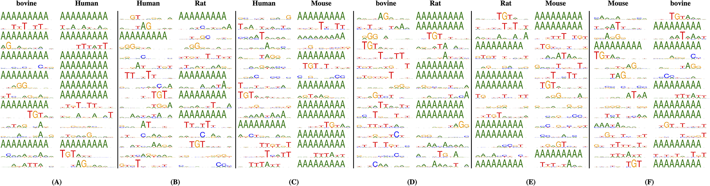

# Poly(A)-DG

Example implementation of the paper:

- Zheng Y, Wang H, Zhang Y, Gao X, Xing EP, Xu M (2020) Poly(A)-DG: A deep-learningbased domain generalization method to identify cross-species Poly(A) signal without prior knowledge from target species. PLoS Comput Biol 16(11): e1008297. https://doi.org/10.1371/journal.pcbi.1008297


## Environments:

```
Python 3.8-3.11
Tensorflow V2
```

## Run

Run `script.py` to run Poly(A)-DG, DeepPolyA, and SANPolyA to perform domain generalization task. 

```
python script.py
```

Running the `script.py` can also generate the plots of cross-species invariant signals captured by conovlution filters in Poly(A)-DG model. You can also simply run `analyze.py` script to fetech the information.


This plot shows species invariant signals the model captured in the target species after learning from two source species. e.g. panel (A) shows that the motif patterns captured by CNN kernel of Poly(A)-DG when it generalizes to bovine and Human after training from mouse and rat data. 

## Datasets :

- Omni Human Poly(A) signal dataset and BL mouse Poly(A) signal datasets come from [DeeReCT-PolyA](https://github.com/likesum/DeeReCT-PolyA). 
- Bovine dataset comes from [DeepGSR](https://academic.oup.com/bioinformatics/article/35/7/1125/5089227). 
- We established a Rat Poly(A) signal dataset which contains 11 Poly(A) signal motifs and the positive signals are built based on the [PolyA DB v3.2 dataset](https://genome.cshlp.org/content/28/10/1427) and we estalished the pesudo PolyA signal following the steps in the [supplementary](https://ndownloader.figstatic.com/files/25407799) in our paper. This dataset consists of roughly 37,000 DNA sequences and the number of true Poly(A) signal sequences is the same as pseudo-ones. 

Details of every steps to show how we establish the Rat Poly(A) signal dataset can be found in the supplementary of Our paper.

----

## Reference

[DeepPolyA](https://github.com/stella-gao/DeepPolyA)

[SANPolyA](https://github.com/yuht4/SANPolyA)

## Contact:

[Yumin Zheng](mailto:zhengyumin529@gmail.com)
